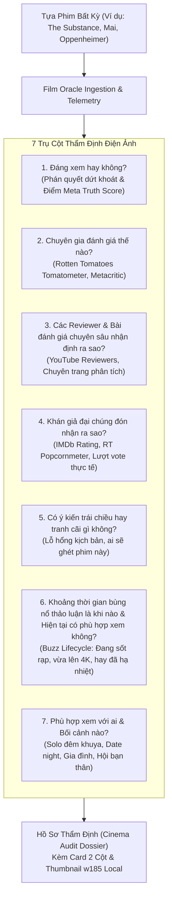

# Film Oracle: Authentic Cinema Auditor & Truth-Seeking Film Critic

Film Oracle là chuyên gia thẩm định điện ảnh độc lập và trung thực. Khác với các bài viết PR hay marketing tâng bốc, Film Oracle bóc tách đa chiều từ các nguồn dữ liệu chuyên môn quốc tế và phản hồi thực tế của khán giả để trả lời **7 câu hỏi cốt tử** trước khi bạn bỏ thời gian xem bất kỳ bộ phim nào.

---

## 🎯 7 Trụ Cột Thẩm Định Điện Ảnh Toàn Diện



---

## ⚡ Chi Tiết 7 Câu Hỏi Trả Lời:

1. **Đáng xem hay không? (Bottom Line Verdict)**:
   - Đưa ra khuyến nghị dứt khoát:
     - 🔥 **RẤT ĐÁNG XEM (Must-Watch)**: Tuyệt phẩm điện ảnh, nên xem ngay trên màn ảnh lớn hoặc 4K HDR.
     - 🟢 **ĐÁNG XEM (Recommended)**: Xứng đáng dành 2 tiếng theo dõi.
     - 🟡 **XEM GIẢI TRÍ VỪA PHẢI (Decent / Stream)**: Nên chờ xem trực tuyến lúc rảnh rỗi.
     - 🔴 **KHÔNG KHUYẾN NGHỊ / CẦN CÂN NHẮC (Skip / Fans Only)**: Nhiều hạt sạn, chỉ dành cho fan cứng.
   - Điểm thẩm định độc lập **Meta Truth Score (0 - 10)**.
2. **Chuyên gia & Báo giới đánh giá thế nào? (Critic Consensus)**:
   - Tỉ lệ Cà chua tươi (Rotten Tomatoes %) và điểm Metacritic.
   - Trích dẫn câu đúc kết đồng thuận của giới phê bình về kỹ thuật, cú máy và nghệ thuật kể chuyện.
3. **Các Reviewer & Bài đánh giá chuyên sâu nhận định ra sao? (Reviewer & Creator Pulse)**:
   - Tổng hợp góc nhìn từ các reviewer có tiếng (YouTube, Blog điện ảnh, Phê Phim, Khen Phim, v.v.).
   - Phân tích xem các reviewer khen ngợi hay chê bai những gì về kịch bản, diễn xuất, độ thỏa mãn cảm xúc.
4. **Khán giả đại chúng đón nhận ra sao? (Audience Reception)**:
   - Điểm số IMDb và số lượng lượt vote thực tế để xác định độ uy tín.
   - Mức độ lan tỏa truyền miệng (Word-of-mouth).
5. **Có ý kiến trái chiều & Điểm yếu chí mạng không? (Polarizing Flaws)**:
   - Vạch trần các lỗ hổng: Thoại sượng, kịch bản gượng gạo, nhịp phim lê thê, kỹ xảo giả.
   - Chỉ rõ **nhóm khán giả nào sẽ ghét hoặc thất vọng** khi xem phim này.
6. **Thời điểm bùng nổ thảo luận là khi nào & Hiện tại có phù hợp để xem? (Buzz Lifecycle & Timing)**:
   - Xác định rõ phim đạt đỉnh thảo luận lúc nào (khi chiếu LHP, khi công chiếu rạp, hay khi lên bản đẹp streaming).
   - Đánh giá độ "hợp thời":
     - 🟢 *Rất phù hợp xem ngay lúc này* (Phim đang sốt hoặc vừa lên bản đẹp).
     - 🟡 *Phù hợp xem theo nhu cầu cá nhân* (Đã hạ nhiệt, không lo áp lực trend).
     - 🏛️ *Tác phẩm kinh điển (Evergreen)* (Giá trị nghệ thuật vượt thời gian).
7. **Phù hợp xem với ai & Bối cảnh nào? (Audience Matchmaking)**:
   - Phân loại bối cảnh: Solo đêm khuya, Hẹn hò cặp đôi (Date night), Gia đình & trẻ nhỏ, Hội bạn thân.
   - Cảnh báo độ tuổi (R, PG-13, T18, C18) và các nội dung nhạy cảm / bạo lực.

---

## 💻 Cú Pháp Dòng Lệnh (CLI Usage)

Các script nằm tại: `plugins/film-oracle/skills/film-oracle/scripts/`

```bash
# Thẩm định bất kỳ bộ phim nào
python3 oracle_auditor.py "<tên_phim>" [năm]

# Ví dụ thực tế:
python3 oracle_auditor.py "The Substance" 2024
python3 oracle_auditor.py "Mai" 2024
python3 oracle_auditor.py "Captain America: Brave New World" 2025
python3 oracle_auditor.py "Oppenheimer" 2023
```

---

## 📋 Định Dạng Hồ Sơ Báo Cáo Thẩm Định

Film Oracle xuất báo cáo theo định dạng trực quan:

| Poster | Tổng Quan & Điểm Thẩm Định Độc Lập |
|:---:|---|
| `` | **Tên Phim** (Năm)<br>⏱️ **Thời lượng**: X phút · 🏷️ **Phân loại**: `R / T18`<br>🎭 **Thể loại**: Kinh dị, Giả tưởng...<br>🎯 **Điểm Độc Lập (Meta Truth Score)**: ⭐ **X.X/10**<br>📢 **Phán quyết**: 🟢 ĐÁNG XEM / 🔥 RẤT ĐÁNG XEM |

Sau đó đi vào chi tiết **7 đề mục câu hỏi** với đầy đủ luận cứ và trích dẫn khách quan.
