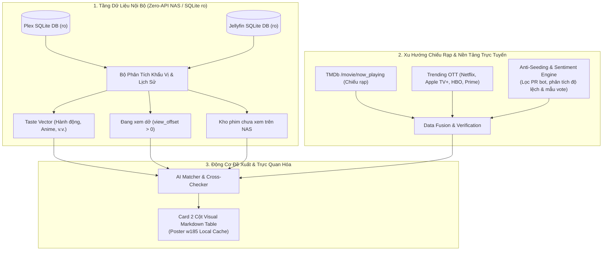

# Media Advisor: Zero-API Cinema & Series Recommendation Concierge

Media Advisor là hệ thống tư vấn và đề xuất phim thông minh cho Homelab & NAS. Khác biệt hoàn toàn với các thuật toán đề xuất thông thường, Media Advisor kết hợp **dữ liệu nội bộ thực tế từ Plex/Jellyfin** (qua kết nối SQLite Read-Only tức thì, zero-auth, không gây lock DB) cùng **dữ liệu xu hướng chiếu rạp & nền tảng OTT** và **bộ lọc chống seeding/PR ảo**.

---

## 🏗️ Kiến Trúc Hệ Thống (Architecture)



---

## ⚡ 5 Năng Lực Cốt Lõi

1. **Zero-API & Zero-Lock SQLite Reader**:
   - Truy vấn trực tiếp `com.plexapp.plugins.library.db` và `jellyfin.db` trong **0.001s** với URI `?mode=ro`.
   - Bắt trọn tiến độ xem dở từng phút, điểm đánh giá người dùng tự chấm, và kho phim tải về nhưng chưa xem.
2. **Khảo Sát Khẩu Vị Linh Hoạt (`setup`)**:
   - Tự động khảo sát sở thích người dùng (thể loại, quốc gia, thời lượng, tiêu chuẩn chống seeding) hoặc lưu bộ mặc định khách quan bao quát toàn bộ (`--defaults`).
3. **Đối Soát Trực Tiếp Với Kho NAS (NAS Cross-Check)**:
   - Khi gợi ý phim rạp hoặc xu hướng, hệ thống tự động kiểm tra xem NAS đã có sẵn file chưa (`🟢 ĐÃ CÓ TRÊN NAS` vs `⚪ Chưa có trên NAS`).
4. **Bộ Lọc Chống Seeding & Review Ảo (Anti-Seeding)**:
   - Kiểm tra số lượng vote tối thiểu, phát hiện các tác phẩm bị "bơm thổi" điểm số hoặc review-bombing, đưa ra huy hiệu xác thực:
     - 🔥 **Siêu phẩm đồng thuận** (Masterpiece: Vote cao, số lượng lớn).
     - 🟢 **Đánh giá thực chất tốt** (Solid Quality).
     - 🟡 **Mẫu khảo sát thấp** (Low Sample: Rủi ro seeding).
     - 🔴 **Chưa đủ dữ liệu** (Unverified: Dưới 50 vote).
5. **Giao Diện Visual Movie Card 2 Cột**:
   - Tải poster `w185` về thư mục cache cục bộ (`~/.cache/media-advisor/posters/`) để đảm bảo hiển thị mượt mà trên UI mà không bị lỗi CSP.
6. **Linh Hoạt 3 Chế Độ Triển Khai (3-Tier Operating Modes)**:
   - 🏠 **Homelab Native (Ưu tiên)**: Tự phát hiện SQLite DB của Plex/Jellyfin trên máy để đọc trực tiếp trong 0.001s.
   - 📡 **Remote Server**: Kết nối Plex/Jellyfin từ xa qua HTTP URL & Token nếu máy chủ nằm ở máy khác.
   - 🌐 **Pure Internet Cinephile**: Nếu máy **không có Plex/Jellyfin** (hoặc người dùng không muốn dùng), hệ thống **hoàn toàn KHÔNG báo lỗi**, tự động chuyển sang chế độ khám phá toàn cầu dựa trên gu khảo sát (`setup`) + xu hướng chiếu rạp & OTT (Netflix, Apple TV, Disney+, HBO Max) kèm huy hiệu nền tảng phát sóng.

---

## 💻 Cú Pháp Dòng Lệnh (CLI Usage)

Các script nằm tại: `plugins/media-advisor/skills/media-advisor/scripts/`

### 1. Khảo Sát Thiết Lập (Survey / Setup)
```bash
# Khảo sát tương tác các tiêu chí (chế độ, thể loại, thời lượng, chống seeding)
python3 advisor_cli.py setup

# Hoặc lưu nhanh cấu hình mặc định (tự động nhận diện, khách quan, bao quát toàn bộ)
python3 advisor_cli.py setup --defaults
```

### 2. Báo Cáo Toàn Diện (Executive Overview)
```bash
python3 advisor_cli.py report
```
Hiển thị tổng quan: Hồ sơ khẩu vị (Taste profile), Phim đang xem dở, Kho báu bỏ quên trên NAS (hoặc đề xuất theo gu khảo sát nếu ở chế độ Internet), và Phim chiếu rạp nổi bật.

### 3. Khám Phá Theo Gu Khảo Sát (Internet Discover)
```bash
python3 advisor_cli.py discover --limit 5
```
Dành riêng cho chế độ không dùng Plex/Jellyfin hoặc muốn tìm phim kinh điển/đỉnh cao trên mạng theo gu đã chọn.

### 4. Tìm Kiếm & Đề Xuất Tự Nhiên (Natural Query)
```bash
python3 advisor_cli.py query "Interstellar" --limit 5
python3 advisor_cli.py query "Anime phiêu lưu" --limit 5
```

### 5. Đề Xuất Phim Chưa Xem Trên NAS (Unwatched Gems)
```bash
python3 advisor_cli.py unwatched --limit 5
```

### 6. Tiếp Tục Theo Dõi (Continue Watching)
```bash
python3 advisor_cli.py continue --limit 5
```

### 7. Phim Đang Chiếu Rạp (Theatrical Releases)
```bash
python3 advisor_cli.py theatrical --limit 5
```

### 8. Xu Hướng Thịnh Hành Trực Tuyến (Trending OTT)
```bash
python3 advisor_cli.py trending --limit 5
```

---

## 📋 Định Dạng Thẻ Visual Movie Card (2 Cột Markdown)

Media Advisor luôn xuất dữ liệu dưới dạng bảng chuẩn:

| Poster | Thông Tin Chi Tiết & Đánh Giá Thực Tế |
|:---:|---|
| `` | **Tên Phim** (Năm)<br>⭐ **Điểm số/10** (Số lượt đánh giá) · Huy hiệu kiểm định<br>📍 **Kho NAS**: 🟢 Sẵn sàng xem ngay / ⚪ Chưa có trên NAS<br>*(hoặc 📺 **Nền tảng phát sóng**: Netflix, Apple TV+, Rạp chiếu phim...)*<br>⏱️ **Tiến độ**: Đã xem X% (phút dở/tổng thời lượng)<br>📝 Tóm tắt nội dung... |

---

## 🔒 Bảo Mật & Lưu Trữ Cấu Hình
- Thông tin cấu hình được lưu tại `<workspace>/.agent/advisor_config.json` và `~/.config/media-advisor/config.json`.
- Token TMDb và Server được tái sử dụng từ `.agent/credentials.json` hoặc `~/.env`, tuyệt đối không in lộ ra báo cáo hay transcript.
