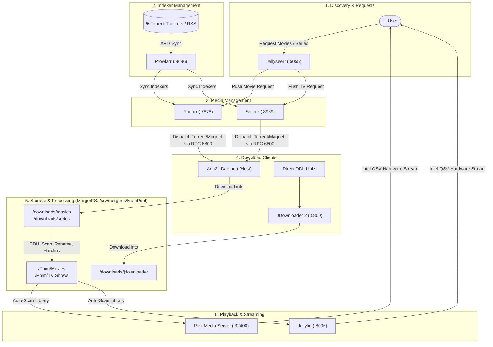

# OMV 7 Media Automation Stack Blueprint

Complete operational blueprint, service interconnects, network ports, storage layouts, and runbooks for the automated media server stack running on OpenMediaVault 7 (Debian 12, Intel Alder Lake-N N150).

## 1. System Environment & Specifications
- **Host OS:** Debian GNU/Linux 12 (Bookworm) with OpenMediaVault 7 (Sandworm)
- **Host LAN IP:** `192.168.1.37`
- **CPU:** Intel Alder Lake-N N150 (Intel QuickSync Video / QSV hardware transcoding enabled)
- **RAM:** 16 GB DDR4/DDR5
- **User Execution Context:** `chungnh:users` (PUID: `1000`, PGID: `100`)

---

## 2. End-to-End Media Automation Pipeline



---

## 3. Network Ports & Service Access Matrix

| Service | Port | Network Mode | Local URL | Primary Function |
| :--- | :--- | :--- | :--- | :--- |
| **Radarr** | `7878` | Host | `http://192.168.1.37:7878` | Movie management & automation |
| **Sonarr** | `8989` | Host | `http://192.168.1.37:8989` | TV Series management & automation |
| **Prowlarr** | `9696` | Host | `http://192.168.1.37:9696` | Torrent tracker & indexer aggregator |
| **Jellyseerr** | `5055` | Bridge | `http://192.168.1.37:5055` | Request manager & discovery frontend |
| **Aria2c** | `6800` | Systemd (Host) | `http://127.0.0.1:6800/jsonrpc` | High-speed torrent/P2P download daemon |
| **AriaNg** | `6880` | Bridge | `http://192.168.1.37:6880` | Aria2c modern Web UI frontend |
| **JDownloader 2** | `5800` | Bridge | `http://192.168.1.37:5800` | Direct HTTP/DDL downloader |
| **Plex Media Server** | `32400` | Host | `http://192.168.1.37:32400/web` | Primary streaming & transcoding server |
| **Jellyfin** | `8096` | Host | `http://192.168.1.37:8096` | Open-source streaming media server |
| **FileBrowser** | `8080` | Bridge | `http://192.168.1.37:8080` | Web-based file manager |
| **Tdarr** | `8265` | Host | `http://192.168.1.37:8265` | Distributed media transcoding & compression |
| **AGY Manager** | `8585` | Host | `http://192.168.1.37:8585` | Antigravity CLI monitor & web UI |
| **OMV WebGUI** | `80` / `443` | Native | `http://192.168.1.37` | NAS & storage management UI |

---

## 4. Storage Topology & Volume Mapping

Unified MergerFS pool mounted at `/srv/mergerfs/MainPool` (Systemd mount unit: `srv-mergerfs-MainPool.mount`):

```
/srv/mergerfs/MainPool/
├── downloads/                     <-- Staging buffer directory
│   ├── movies/                    <-- Radarr & Aria2c (Container mount: /downloads)
│   ├── series/                    <-- Sonarr & Aria2c (Container mount: /downloads)
│   └── jdownloader/               <-- JDownloader 2 downloads
├── Phim/                          <-- Persistent Media Library
│   ├── Movies/                    <-- Radarr target (/movies) -> Plex & Jellyfin library
│   └── TV Shows/                  <-- Sonarr target (/series) -> Plex & Jellyfin library
└── books/                         <-- Calibre e-book storage
/appdata/                          <-- Persistent Docker configurations & SQLite databases
/docker-files/                     <-- Compose project templates (OMV Compose Plugin)
```

---

## 5. Inter-Service Configuration & API Keys

### Prowlarr -> Radarr & Sonarr (Indexer Auto-Sync)
- **Prowlarr Settings > Applications > Add Radarr**:
  - Radarr Server: `http://127.0.0.1:7878`
  - API Key: `fb019af0200043529f571c102ea3af86`
- **Prowlarr Settings > Applications > Add Sonarr**:
  - Sonarr Server: `http://127.0.0.1:8989`
  - API Key: `b9491ff3d23b4021ac0d35124deee312`

### Jellyseerr -> Radarr & Sonarr (Request Forwarding)
- **Jellyseerr Settings > Services > Add Radarr**:
  - Hostname / IP: `192.168.1.37` (bridge network uses host IP), Port: `7878`
  - API Key: `fb019af0200043529f571c102ea3af86`
  - Root Folder: `/movies`
- **Jellyseerr Settings > Services > Add Sonarr**:
  - Hostname / IP: `192.168.1.37`, Port: `8989`
  - API Key: `b9491ff3d23b4021ac0d35124deee312`
  - Root Folder: `/series`

### Radarr / Sonarr -> Aria2c (Download Client)
- **Settings > Download Clients > Add Aria2**:
  - Host: `127.0.0.1`
  - Port: `6800`
  - Use SSL: `No`
  - RPC Secret: `As123456`

---

## 6. Operational Runbooks & CLI Troubleshooting

```bash
# 1. Check health of all media stack containers
sudo docker ps --format "table {{.Names}}\t{{.Status}}\t{{.Ports}}"

# 2. Check Aria2c systemd daemon status
sudo systemctl status aria2.service --no-pager

# 3. Test Aria2 JSON-RPC connectivity
curl -s -X POST http://127.0.0.1:6800/jsonrpc -d '{"jsonrpc":"2.0","id":"q","method":"aria2.getVersion","params":["token:As123456"]}'

# 4. Pull and update all compose services via OMV plugin
sudo omv-compose-update-multi

# 5. Clean up unused images and free space
sudo docker image prune -f

# 6. Run built-in diagnostic script
~/.agents/skills/omv-media-stack/scripts/check_stack.sh
```
