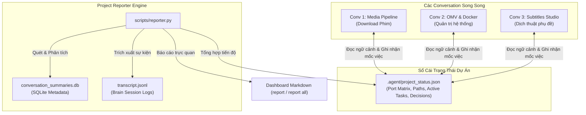

# Project Reporter & Multi-Conversation Orchestrator Skill

Kỹ năng điều phối tiến độ đa phiên (Multi-Conversation Orchestration) và tổng hợp báo cáo dự án cho Antigravity CLI, Gemini CLI, và Claude Code.

---

## 🎯 1. Nỗi Đau Được Giải Quyết (The Problem Solved)

Khi làm việc trên nhiều conversation thuộc cùng một dự án:
1. **Phân mảnh ngữ cảnh (Context Fragmentation):** Các conversation bị cô lập, không biết các phiên khác đã sửa file nào, mount cổng port nào, đổi đường dẫn thư mục nào.
2. **Lệch trạng thái (State Drift):** Agent ở phiên mới có thể ghi đè hoặc làm lại công việc mà phiên trước đã hoàn thành.
3. **Mất dấu tiến độ (Lost Progress):** Người dùng thiếu góc nhìn toàn cảnh (*Bird's-eye view*) về toàn bộ dự án: conv nào đang làm gì, việc gì đã xong, việc gì còn dở.

`project-reporter` cung cấp một **Sổ Cái Tập Trung (Shared Ledger)** và **Động Cơ Báo Cáo Thông Minh (Reporter Engine)** để kết nối mọi phiên làm việc.

---

## 🏛️ 2. Kiến Trúc 3 Tầng (3-Layer Architecture)



---

## 🚀 3. Hướng Dẫn Sử Dụng & Kích Hoạt

### Khi Người Dùng Yêu Cầu Báo Cáo:

1. **Báo cáo toàn bộ dự án (`report all` hoặc `report/all`):**
   ```bash
   python3 ~/.agent-skills/plugins/project-reporter/skills/project-reporter/scripts/reporter.py --all
   ```
   * Tự động quét cơ sở dữ liệu `conversation_summaries.db` theo workspace hiện tại.
   * Lập bảng ma trận toàn bộ các phiên làm việc, thời gian thao tác, số lượng steps.
   * Trích xuất các yêu cầu cốt lõi của user, danh sách files đã can thiệp, và kỹ năng đã sử dụng.

2. **Báo cáo sâu một phiên cụ thể (`report <conv-id>` hoặc `report <keyword>`):**
   ```bash
   python3 ~/.agent-skills/plugins/project-reporter/skills/project-reporter/scripts/reporter.py --conv <conv_id>
   ```
   * Đọc chi tiết `transcript.jsonl` của phiên đó: mục tiêu ban đầu, các lỗi đã giải quyết, các file đã thay đổi, lệnh bash gần nhất.

3. **Đồng bộ phiên hiện tại vào Sổ Cái (`report sync` hoặc tự động khi xong mốc lớn):**
   ```bash
   python3 ~/.agent-skills/plugins/project-reporter/skills/project-reporter/scripts/reporter.py --sync
   ```
   * Cập nhật ngay lập tức snapshot của conversation hiện tại vào file `.agent/project_status.json`.

---

## 🧭 4. Cấu Trúc File Sổ Cái (`.agent/project_status.json`)

File được lưu tại thư mục gốc của Workspace:

```json
{
  "project_name": "AI Workspace",
  "updated_at": "2026-09-24T13:50:00Z",
  "shared_state": {
    "ports": {
      "Prowlarr": 9696,
      "Radarr": 7878,
      "Sonarr": 8989,
      "Aria2_RPC": 6800,
      "MeTube": 8081,
      "FlareSolverr": 8191
    },
    "paths": {
      "tv_shows": "/srv/mergerfs/MainPool/Phim/TV Shows",
      "movies": "/srv/mergerfs/MainPool/Phim/Movies",
      "downloads": "/srv/mergerfs/MainPool/downloads"
    },
    "architecture_decisions": [
      "Đặt tên theo quy chuẩn Plex/Jellyfin: {tvdb-ID} và {tmdb-ID}",
      "Khống chế tối đa 2-3 kết nối đồng thời với TorBox CDN để chống lỗi HTTP 429",
      "Dùng Aria2 làm download client nội bộ kết nối Prowlarr/TorBox"
    ]
  },
  "conversations": {
    "ab78a8d5-9fd6-4270-9d00-16908ee29a0a": {
      "title": "Download Phim",
      "last_synced": "2026-09-24T13:50:00Z",
      "completed_milestones": [
        "Hoàn tất tải Season 1 (16 tập), Season 2 (22 tập), Season 3 (20 tập), Season 4 (12 tập) Tây Hành Kỷ",
        "Hoàn tất tải 21 tập Ngoại truyện Specials (Cuồng Vương + Ngộ Không)",
        "Hoàn tất Movie 1 (Tái Kiến Ngộ Không 1080p BluRay)",
        "Đang kéo 33 tập Season 5"
      ]
    }
  }
}
```

---

* **Rule 1 (Zero Context Drift):** Khi khởi đầu một task phức tạp hoặc sang một phiên chat mới, agent luôn kiểm tra `.agent/project_status.json` trước để nắm toàn bộ bức tranh kiến trúc và tài nguyên của hệ thống.
* **Rule 2 (Keep Ledger Updated):** Sau khi hoàn tất một thay đổi quan trọng về cấu hình (đổi port, đổi đường dẫn, hoàn tất download series phim lớn), luôn gọi `--sync` hoặc cập nhật `.agent/project_status.json`.
* **Rule 3 (Absolute Secret & Privacy Protection):** Tuyệt đối không lưu trữ, xuất bản hoặc hiển thị API key, Token, Secret, Password, Credentials trong báo cáo Markdown hay trong sổ cái `.agent/project_status.json`. Bộ lọc `mask_sensitive_data` trong `reporter.py` tự động phát hiện và che giấu (redact) toàn bộ token, bearer authorization, key-value secrets và thông tin nhạy cảm trước khi xuất báo cáo. Chỉ lưu cấu hình tham chiếu (ví dụ: `PROWLARR_API_KEY: "<configured in ~/.env>"`) thay vì lưu giá trị thật.
