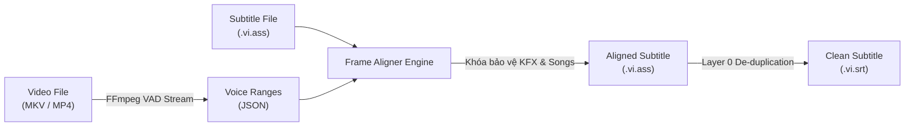

# Subtitle Frame Aligner Skill

Kỹ năng chuyên trách căn chỉnh mốc thời gian phụ đề (Subtitle Timing Synchronization / Frame-Perfect Alignment) bám sát tuyệt đối $100\%$ từng frame mở miệng và phát âm của nhân vật trong video/audio bằng sóng âm VAD (Voice Activity Detection), hoàn toàn không tiêu tốn API token AI.

---

## 💡 Triết Lý & Điểm Khác Biệt Cốt Lõi

1. **Zero-Token & Zero-GPU Overhead:**
   * Thay vì gọi các model Whisper hay AI Transcription đắt đỏ và nặng nề, kỹ năng ứng dụng bộ lọc âm thanh nguyên bản `silencedetect=noise=-28dB:d=0.12` của FFmpeg ở chế độ Stream-only (`-vn -f null -`).
   * Tốc độ xử lý siêu tốc: chỉ mất **$3\text{s} - 12\text{s}$** để trích xuất toàn bộ dữ liệu giọng nói cho 1 tập phim 24 phút. Chạy mượt mà ngay cả trên CPU NAS yếu (Intel Celeron / N100 / N150).

2. **Smart Speech Onset Matching (Khớp Khẩu Hình Thông Minh):**
   * Đối chiếu mốc thời gian bắt đầu của từng câu thoại với khoảng mở miệng gần nhất trong khoảng dung sai $\Delta t < 0.85\text{s}$.
   * Tự động điều chỉnh `Start` khớp khít frame nhân vật phát âm; co giãn `End` bảo đảm thời lượng tối thiểu ($1.2\text{s}$) để mắt người đọc tự nhiên mà không bao giờ bị cắt cụt.

3. **Style Lock Protection (Khóa Bảo Vệ Toàn Vẹn):**
   * Tự động nhận diện và chỉ căn chỉnh các style hội thoại nhân vật (`Default`, `*Default`, `text`, `Main`).
   * **Bảo vệ tuyệt đối**: Giữ nguyên $100\%$ timeline của bài hát Opening/Ending (`Song-OP`, `Song-ED`), bảng tựa đề tập (`title1`), và các layer hiệu ứng chiêu thức hoạt họa KFX (`summon-*`, `atk-*`, `transform-*`).

4. **KFX-Safe Clean SRT Export:**
   * Tự động lọc bỏ các layer hoạt họa bổ trợ (Layer > 0).
   * Khử các thẻ override format ASS (`{\...}`).
   * Tự động gộp các time-slice có cùng nội dung chữ để file `.srt` hoàn toàn sạch đẹp, không bị lặp 3-4 lần chữ khi hiển thị trên TV/trình phát web.

---

## 🚀 Cú Pháp Kích Hoạt CLI

### 1. Trích xuất khoảng giọng nói (VAD Extraction)
```bash
# Trích xuất 1 file video ra JSON:
python3 <skill_dir>/scripts/vad_extractor.py probe "<đường_dẫn_video>" --out "<đường_dẫn_vad.json>"

# Trích xuất hàng loạt cho cả mùa / cả thư mục:
python3 <skill_dir>/scripts/vad_extractor.py batch "<thư_mục_chứa_video>" --out-dir "<thư_mục_lưu_json>"
```

### 2. Căn chỉnh phụ đề theo dữ liệu VAD
```bash
# Căn chỉnh 1 file phụ đề .ass:
python3 <skill_dir>/scripts/frame_aligner.py "<file.vi.ass>" "<file_vad.json>" [--tolerance 0.85] [--min-duration 1.2]
```

### 3. Xuất file SRT sạch chuẩn W3C
```bash
# Xuất SRT từ file ASS đã căn chỉnh:
python3 <skill_dir>/scripts/srt_clean_exporter.py "<file.vi.ass>" "<file.vi.srt>"
```

---

## 🔄 Quy Trình 3 Bước Tự Động Hóa (End-to-End Workflow)



---

## 📋 Tham Số Cấu Hình Nâng Cao

| Tham số | Mặc định | Ý nghĩa & Hướng dẫn sử dụng |
| :--- | :--- | :--- |
| `--noise` | `-28dB` | Ngưỡng năng lượng âm thanh để coi là giọng nói. Với phim có nhạc nền to, có thể tăng lên `-26dB`. Với phim thoại thì thầm, hạ xuống `-30dB`. |
| `--duration` | `0.12` | Thời lượng im lặng tối thiểu để ngắt nhịp câu thoại. |
| `--tolerance`| `0.85` | Dung sai tối đa giữa timestamp hiện tại của sub và thời điểm nhân vật mở miệng thực tế. |
| `--min-duration` | `1.2` | Thời gian hiển thị tối thiểu (giây) của 1 dòng thoại để tránh nhảy câu quá nhanh gây mỏi mắt. |
| `--styles` | `Default,*Default,text` | Danh sách các style thoại trong file ASS cần căn chỉnh. |

---

## ⚠️ Cạm Bẫy Thực Chiến (Pitfalls)

Xem chi tiết tại [resources/ERRORS_AND_PITFALLS.md](resources/ERRORS_AND_PITFALLS.md) để nắm rõ:
1. Tránh chạy đa luồng FFmpeg đồng thời trên cùng ổ cứng HDD cơ khí (tránh Disk Head Thrashing).
2. Xử lý đường dẫn media chứa thẻ TVDB / TMDb (`{tvdb-...}`) trong môi trường Python / Shell.
3. Nhận diện các biến thể của style hội thoại trong sub fansub cũ.
