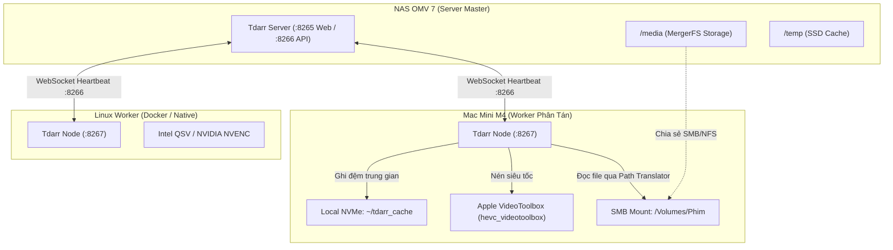

# Tdarr Distributed Node Operational Skill

Kỹ năng chuyên sâu về cài đặt, tối ưu hóa và vận hành **Tdarr Node** (Client worker phân tán) kết nối về Tdarr Server trung tâm trên NAS OMV 7 (`192.168.1.37`).

---

## 1. Kiến trúc Cụm Tdarr (Server - Node Architecture)



- **Server Role:** Quản lý cơ sở dữ liệu, quét thư viện, xếp hàng đợi (Queue), phân phối việc cho các Node.
- **Node Role:** Kéo file theo đường dẫn đã ánh xạ (Path Translators), tận dụng GPU/CPU của máy trạm để nén rồi trả file về lại kho lưu trữ.

---

## 2. Ma trận cấu hình Path Translators (`Tdarr_Node_Config.json`)

Lỗi phổ biến nhất khi triển khai Node là **`ENOENT: no such file or directory`**. Điều này xảy ra do Server chạy Linux (`/media/...`) trong khi Node chạy macOS (`/Volumes/...` hoặc `/Users/...`).

### File cấu hình chuẩn: `Tdarr_Node_Config.json`
Được đặt trong thư mục gốc của Node (ví dụ `~/Tdarr_Node/` trên Mac):

```json
{
  "nodeID": "MacMini-M4",
  "nodeIP": "192.168.1.4",
  "nodePort": "8267",
  "serverIP": "192.168.1.37",
  "serverPort": "8266",
  "handbrakePath": "",
  "ffmpegPath": "",
  "mkvpropeditPath": "",
  "pathTranslators": [
    {
      "server": "/media",
      "node": "/Volumes/Phim"
    },
    {
      "server": "/temp",
      "node": "/Users/chungnh/tdarr_cache"
    }
  ],
  "nodeType": "native",
  "cronPluginUpdate": ""
}
```

> [!IMPORTANT]
> - **Quy tắc 1:** Luôn dùng ổ cứng SSD nội bộ của Node (ví dụ `/Users/chungnh/tdarr_cache`) làm thư mục đệm (`cache`). Không trỏ cache qua đường mạng SMB để tránh nghẽn băng thông LAN.
> - **Quy tắc 2:** Đường dẫn `node` phải khớp chính xác 100% với điểm mount thực tế trên máy client.

---

## 3. Quy trình Triển khai trên macOS (Apple Silicon M-Series)

Chip Apple Silicon (M1/M2/M3/M4) trang bị bộ tăng tốc phần cứng **Apple VideoToolbox** với hiệu năng nén HEVC 10-bit cực cao và tiêu thụ điện siêu thấp.

### Bước 1: Tải và cài đặt Binary Native
```bash
# 1. Tạo thư mục làm việc
mkdir -p ~/Tdarr_Node ~/tdarr_cache
cd ~/Tdarr_Node

# 2. Tải bản Tdarr Node cho macOS ARM64
curl -LO https://github.com/HaveAGitGat/Tdarr/releases/latest/download/Tdarr_Node-darwin-arm64.zip
unzip Tdarr_Node-darwin-arm64.zip
chmod +x Tdarr_Node

# 3. Đặt file cấu hình Tdarr_Node_Config.json vào thư mục ~/Tdarr_Node/
```

### Bước 2: Tự động Mount SMB Share khi mở máy
Để Node không bị mất file sau khi khởi động lại, mount SMB volume vào macOS:
```bash
osascript -e 'mount volume "smb://chungnh@192.168.1.37/Phim"'
```

### Bước 3: Cài đặt Daemon chạy ngầm 24/7 qua `launchd`
Tạo file `~/Library/LaunchAgents/com.tdarr.node.plist`:

```xml
<?xml version="1.0" encoding="UTF-8"?>
<!DOCTYPE plist PUBLIC "-//Apple//DTD PLIST 1.0//EN" "http://www.apple.com/DTDs/PropertyList-1.0.dtd">
<plist version="1.0">
<dict>
    <key>Label</key>
    <string>com.tdarr.node</string>
    <key>ProgramArguments</key>
    <array>
        <string>/Users/chungnh/Tdarr_Node/Tdarr_Node</string>
    </array>
    <key>WorkingDirectory</key>
    <string>/Users/chungnh/Tdarr_Node</string>
    <key>RunAtLoad</key>
    <true/>
    <key>KeepAlive</key>
    <true/>
    <key>StandardOutPath</key>
    <string>/Users/chungnh/Tdarr_Node/tdarr_node.log</string>
    <key>StandardErrorPath</key>
    <string>/Users/chungnh/Tdarr_Node/tdarr_node_error.log</string>
</dict>
</plist>
```

Kích hoạt service:
```bash
launchctl load ~/Library/LaunchAgents/com.tdarr.node.plist
```

---

## 4. Quy trình Triển khai trên Linux (Docker / Native)

### Triển khai bằng Docker Compose
Dành cho máy phụ chạy Ubuntu/Debian có card đồ họa Intel QSV hoặc NVIDIA:

```yaml
version: "3.8"
services:
  tdarr-node:
    container_name: tdarr-node
    image: ghcr.io/haveagitgat/tdarr_node:latest
    restart: unless-stopped
    network_mode: host
    environment:
      - TZ=Asia/Ho_Chi_Minh
      - PUID=1000
      - PGID=100
      - nodeID=Worker-Linux
      - nodeIP=0.0.0.0
      - nodePort=8267
      - serverIP=192.168.1.37
      - serverPort=8266
    volumes:
      - /appdata/tdarr/node_configs:/app/configs
      - /srv/mergerfs/MainPool/Phim:/media
      - /srv/mergerfs/MainPool/tdarr_cache:/temp
    devices:
      - /dev/dri:/dev/dri # Cho Intel QuickSync (QSV)
```

---

## 5. Script Kiểm tra & Giám sát Cụm Node

Sử dụng script tích hợp sẵn trong skill để kiểm tra tình trạng kết nối các node và worker:

```bash
python3 /home/chungnh/.agent-skills/plugins/tdarr-node/skills/tdarr-node/scripts/check_node_status.py
```

Kết quả mẫu:
```text
==================================================
       TDARR DISTRIBUTED CLUSTER STATUS           
==================================================
🖥️  Server Status: good | Version: 2.88.01 | Engine: nodejs

📡 Connected Nodes: 2

  • [NAS-N150] (unknown) - ⏸️  PAUSED
    - Worker Config : CPU Limit = 0 | GPU Limit = 0
    - Active Workers: 0 running

  • [MacMini-M4] (unknown) - 🟢 ACTIVE
    - Worker Config : CPU Limit = 0 | GPU Limit = 0
    - Active Workers: 0 running
==================================================
```

---

## 6. Sổ tay Xử lý Sự cố (Troubleshooting Runbook)

### 1. Lỗi `ENOENT: no such file or directory`
- **Nguyên nhân 1:** Sai lệch Path Translators giữa Server và Node.
  - *Khắc phục:* Mở `Tdarr_Node_Config.json` và kiểm tra lại cặp `"server"` vs `"node"`. Đảm bảo đường dẫn `node` có thể `ls` được trên máy client.
- **Nguyên nhân 2:** Tên file chứa ký tự hai chấm (`:`).
  - *Hiện tượng:* Tệp trên Linux có tên `Doraemon: Nobita...`, macOS SMB mount sẽ mã hóa `:` thành ký tự Unicode lạ (`%3A` hoặc ký tự private use area).
  - *Khắc phục:* Dùng Sonarr/Radarr chuẩn hóa lại định dạng đặt tên file bỏ dấu `:` (thay bằng ` - `).

### 2. Lỗi `ECONNREFUSED 192.168.1.37:8266`
- **Hiện tượng:** Node log liên tục báo mất kết nối tới Server.
- **Nguyên nhân:** Tdarr Server trên NAS đang restart hoặc firewall chặn port `8266`.
- **Khắc phục:** Tdarr Node có cơ chế tự retry backoff. Sau khi Server khởi động xong (~10s), Node sẽ tự động reconnect mà không cần can thiệp thủ công.

### 3. Điều chỉnh giới hạn Worker tối ưu
- **Mac Mini M4 (16GB - 24GB RAM):**
  - Khi cần máy mát mẻ để làm việc: `GPU Limit: 1` hoặc `2`, `CPU Limit: 0` hoặc `1`.
  - Khi cắm máy qua đêm: `GPU Limit: 2`, `CPU Limit: 2` (tối đa hiệu năng VideoToolbox + đa nhân).
